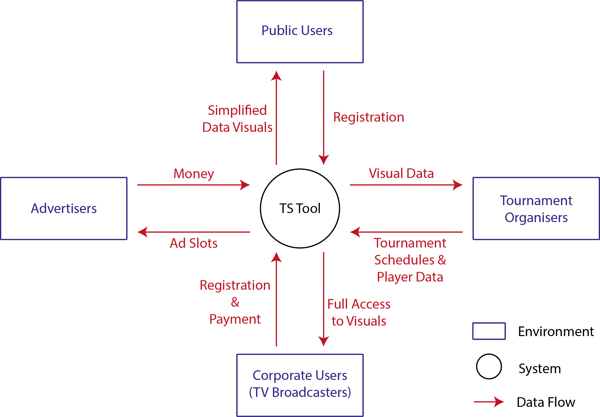
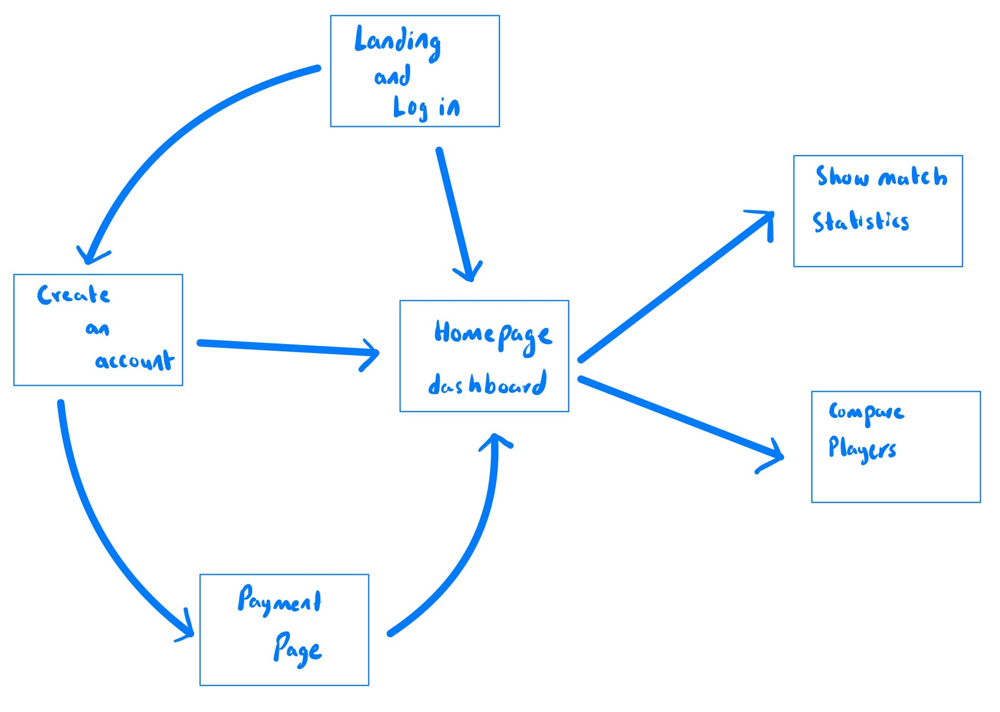
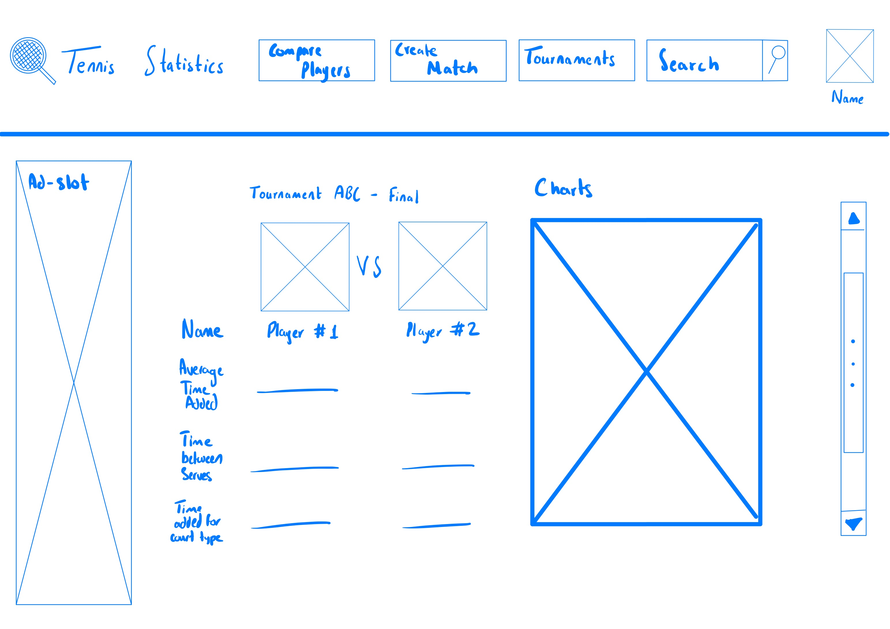

# Coursework 2

## Introduction
In coursework 1, a plan was set up for building a datascience software for a client. The purpose of the software is to
act as a tool to visualize statistics about tennis match times. This software would bve used by tournament organizers
and broadcasters to allocate times for matches. The software has been named Tennis Statistics (TS) tool.

## Requirements definition and analysis
User Stories of a software development process point out features that must be present in the completed version of the
software. These requirements can be functional meaning that they specify a specific feature or action to be added to
the system. Another type of requirements is non-functional requirements which specify features regarding the performance
and usability of the software. This part focuses on the methods used to elicit and prioritise these requirements.

### Identification methods
To identify the requirements, the methods listed on Business Analysis Body of Knowledge (BABOK). BABOK recommends a list
of techniques used to elicit the requirements of a software engineering project. The listed techniques are:

- Interviews
- Workshops
- Surveys
- Interface Analysis
- Focus Groups
- Observation
- Brainstorming
- Prototyping
- Analysing Documentation

Due to the time constraint of this project, not all the listed techniques can be utilised. The ones that can fit into
the timeframe of the project are **interviews**, **surveys**, **brainstorming**, and **documentation analysis**. Thus,
these will be the methods used for elicitation of requirements.

Two of the selected methods, interviews and surveys, require to be done with appropriate people to achieve the best
results. To identify these people of interest, a context diagram is provide a vague idea of the use of the software.
###

###
Based on the figure shown above interviews need to be held with potential corporate users and advertisers. Furthermore,
surveys are a good method of data collection from the general user base. Another point that needs to be taken into
consideration is the fact that the team is working using an agile variant of CRISP-DM methodology. Thus, regular 
meetings with the clients is another method used to set project requirements.

### Specification method
As the methodology being used is an agile one, the requirements will be recorded as user stories. These user stories
will be listed along with conditions of satisfaction for each one of them. The user stories will include features
recommended by users along with the purpose and functionality of the feature.

### Prioritisation method
To prioritise the user stories, a combination of two techniques will be used. First, the user stories will be split
using there MoSCoW method. This will split the user stories into four main categories. The categories are as follows:

- **Must have**: The feature must be included in the final product
- **Should have**: The feature is of great importance but not as crucial and time sensitive as the previous category
- **Could have**: The feature provides great additions to the product but will not be considered at the moment due to time and budget constraints
- **Won't have**: The feature provides little input ot the project and will be considered if there is time left to work on the project

Using MoSCoW, the features will be split into groups and the next phase of prioritisation will start. As the method used
is an agile methodology, regular scrum meetings need to take place. In these meetings, the team will decide to sort each
category further and add the user stories into a product backlog. This order can change throughout the development phase
and the user stories can be moved to new MoSCoW subgroup.

### Documented and prioritised requirements
The following is a list of prioritised user stories. Note that the order of importance can change during the development
process and that the following order was achieved after the first scrum meeting.

 User Story ID | User Story | Conditions of Satisfaction | Functional (F) / Non-Functional (NF) | MoSCoW Priority
--- | --- | --- | --- | ---
US01 | As the owner, I want to be able to prove to account types, a free and a paid one, so that the paid account shows more detailed data | <ul><li>When signing up for an account, a premium and free account option must be given</li><li>Choosing the paid version triggers an extra step for payment</li></ul> | F | Must have
US02 | As an app user, I want to be able to create an account so that I save visual statistics | <ul><li>Each account holder must have a library to save statistics</li><li>Free users will be limited to 30 saved visuals</li></ul> | F | Must have
US03 | As an app user, I want to be able to run the application on all desktop versions of Google Chrome and Safari so that the application can be accessed on most computers | <ul><li>Software needs to run on both browsers</li><li>There must be no bugs or glitches present</li></ul> | NF | Must have
US04 | As a moderator, I want to be able to carry transactions through the app so that I can process subscription and advertising fees | <ul><li>A payment gateway must be connected to the app</li><li>If a purchase is to be made, the user must be redirected to the payment gateway to insert card details</li></ul> | F | Must have
US05 | As a broadcaster, I want to have detailed play by play times so that I can fit ad-breaks | <ul><li>For premium package holders only</li><li>Detailed analysis with accurate approximations of wait time between serves</li><ul> | F | Must have
US06 | As an app user, I want my user data to be stored securely so that my data does not get shared with external sources | <ul><li>System will use end-to-end encryption to ensure safety of data being transferred</li><li>Servers must use top of the line encryption</li></ul> | NF | Must have
US07 | As an organizer, I want to be able to have an all access account to have permission to add data | <ul><li>New data from tournaments can be added to database</li><li>Organizer account types can add these new data</li><li>Special organizer accounts are required for this to work</li><li>This type of account can only be created by the software owner at the request of the organizers</li></ul> | F | Must have
US08 | As a moderator, I want to have ad slots so that I can attract advertisers as a source of income | <ul><li>Empty spaces must be left throughout the web app to display advertisements</li><li>Premium users dont get to see advertisements</li></ul> | F | Must have
US09 | As a public user, I want to be able to visualize match-up times to predict game times | <ul><li>For each match, a predicted game time will be displayed</li><ul> | F | Must have
US10 | As an app user, I want to be able to see the player pictures so that I can easily identify them | <ul><li>Players will be assigned a unique ID</li><li>Pictures of players will be stored in the database and each picture will be linked to this ID</li><li>Wherever the player photos is required, the unique ID will be used to embed this picture</li></ul> | F | Should have
US11 | As an organizer, I want to be able to add competitions so that they would be available on the system | <ul><li>New competitions can be added to the web app by the organizers</li><li>Matchups and tournament brackets can be added to database by the organizers</li></ul> | F | Should have
US12 | As a moderator, I want to be able to receive feedback so that I can improve the user experience | <ul><li>A feedback button must be present in all screens</li><li>A drop dwn menu with purpose of feedback must appear</li><li>Feedback can be given to improve UX, correct faulty data, and report bugs</li></ul> | F | Should have
US13 | As an app user, I want to be able to create matchups so that I can predict times of potential matchups | <ul><li>A tool will be designed to predict match times</li><li>Users will have the option to choose players, number of sets, and number of games</li></ul> | F | Should have
US14 | As an app user, I want to be able to see upcoming games in the app dashboard so that it takes less time to get visuals | <ul><li>Data input by tournament organizers will be used to implement this feature</li><li>Homepage will display all the upcoming matches and the relevant statistics</li></ul> | F | Could have
US15 | As an app user, I want to be able to see tennis news so that I am up to date with the sport | <ul><li>A credible news API will be used to get news</li><li>The breaking news will be displayed on the homepage when logged in</li></ul> | F | Could have
US16 | As a paid user, I want to receive a reminder before my next subscription payment so that I am reminded of my direct debit | <ul><li>Reminders will be sent to the registered email address before processing the transaction</li></ul> | NF | Could have
US17 | As an app user, I want to be able to favorite matchups so that I can quickly display visuals on the matchup | <ul><li>Favourite button is added for each matchup</li><li>Clicking on the button makes the match appear on the homepage</li></ul> | F | Won't have
US18 | As an app user, I want to be able use the application on iOS and Android devices so that I can use it on mobile devices | <ul><li>Mobile version of the web app must be created</li><li>Needs to be optimized for touch controls</li><ul> | NF | Won't have

## Design
### User Interface Flow

### Wireframes
#### Landing Page

###
#### Creating an account

###
#### Homepage

###
#### Match time statistics

### Relational database design
#### Conceptual Design

##
#### Logical Design
To create this model, the team normalised the relationships and thus more tables were created to separate the data.
Furthermore, it has been decided that if users wish to delete their accounts, all data connected to that username will
be deleted as data will not be stored against the will of the users. However, if a record regarding any of the tennis
players and games is to be deleted, the software will only allow the user to hide this record. This ensures that overall
that the accuracy of the created visual charts is not lost. The final diagram is shown below.

### Design Pattern
For the design pattern, the development team has opted to use an MVC model. This type of structure splits the program
logics into three interconnected elements. These elements are the model, view, and the controller. Hence, the structure
is named 'MVC'.

The system works in a series of steps as shown above. First the user enters a URL and the software will find a matching
route. Then the controller function associated with the route is triggered. Then the model will pull the required data
from the database server and this is passed on to the view. The view uses the data to render a page using the adequate
HTML code. Finally, the rendered page is rendered to the user.

## Testing
### Choice of unit testing library

### Tests
The tests should be in a separate and appropriately named file/directory.

### Test results
Provide evidence that the tests have been run and the results of the tests (e.g. screenshot).

### Continuous integration (optional)
Consider using GitHub Actions (or other) to establish a continuous integration pipeline. If you do so then please provide a link to the .yml and a screenshot of the results of a workflow run.

## Weekly progress reports

Copy and paste from Moodle or use the following structure. Delete this instruction text.

What I did in the last week:

- item
- item

What I plan to do in the next week:

- item
- item

Issues blocking my progress (state ‘None’ if there are no issues):

- item
- item

### Report 1

### Report 2

### Report 3

### Report 4

## References

Delete this instruction text before submitting:

- Include references to any templates you have used.
- If you justify any of your choices with references then remember to also include these.
- Use any [referencing style](https://library-guides.ucl.ac.uk/referencing-plagiarism/referencing-styles) that you are
  used to using in your course.
